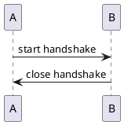

---  
share: true    
---  
  
# Hello 1    
  
## What to say!?    
  
# Hello 2    
  
```puml  
  
Alice -> Bob  
  
```  
  
    
    
  

  
    
    
  
  
```puml  
  
@startuml C4_Elements  
  
Person(personAlias, "Label", "Optional Description")  
Container(containerAlias, "Label", "Technology", "Optional Description")  
System(systemAlias, "Label", "Optional Description")  
  
Rel(personAlias, containerAlias, "Label", "Optional Technology")  
@enduml  
```  
